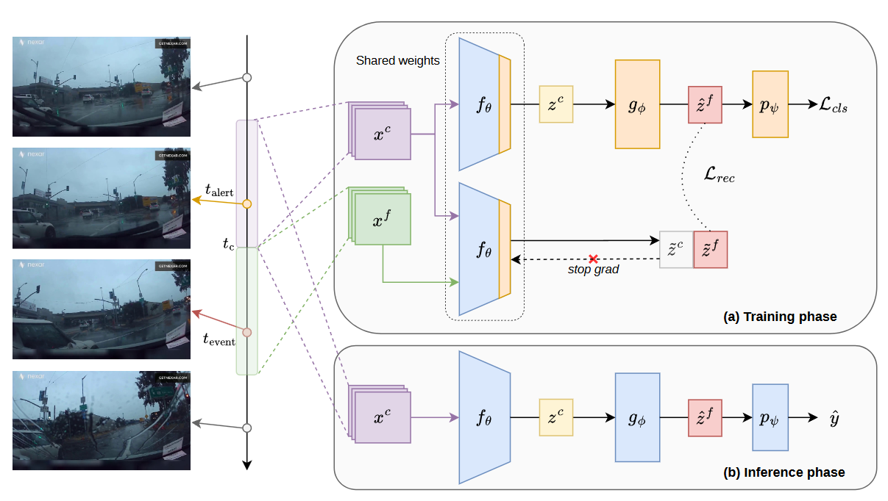

# FLaRA (ITSC 2026)
### Predicting Future Latent Representations for Accident Anticipation

[](https://arxiv.org/abs/2606.14380)
[](https://github.com/LoreCase073/FLaRA)

This is the **official repository** of the [**ITSC 2026 paper**](https://arxiv.org/abs/2606.14380)
"*FLaRA: Predicting Future Latent Representations for Accident Anticipation*"
by Lorenzo Caselli, Tomaso Trinci, Tommaso Bianconcini, Simone Magistri, Leonardo Taccari, Francesco Sambo, Andrew D. Bagdanov.

## Abstract

Current accident anticipation methods typically map observed context directly to collision probabilities, limiting their ability to reason about how scenes will evolve. We propose FLaRA, which shifts this paradigm toward **forecasting future latent scene representations**. Built on [V-JEPA2](https://github.com/facebookresearch/vjepa2), FLaRA uses the predictor network — conditioned on observed context frames — to generate latent representations of upcoming temporal positions. Classification is then performed exclusively on the predicted future representations, enabling the model to anticipate accidents before they occur. The training objective combines a **cross-entropy classification loss** with an auxiliary **feature-level reconstruction loss** (smooth L1) that aligns predicted future tokens with encoder outputs of actual future frames. FLaRA is trained on the Nexar dashboard-camera dataset and evaluated cross-domain on DAD, DADA-2000, and DoTA, achieving state-of-the-art performance across all benchmarks.

<p align="center">
  
</p>

## Citation

```bibtex
@article{caselli2026flara,
  title={FLaRA: Predicting Future Latent Representations for Accident Anticipation},
  author={Caselli, Lorenzo and Trinci, Tomaso and Bianconcini, Tommaso and Magistri, Simone and Taccari, Leonardo and Sambo, Francesco and Bagdanov, Andrew D},
  journal={arXiv preprint arXiv:2606.14380},
  year={2026}
}
```

<details>
<summary><h2>Installation</h2></summary>

The codebase has been tested with **Python 3.10** and **PyTorch 2.7+**.

```bash
conda create -n flara python=3.10
conda activate flara
pip install -r requirements.txt
```

The V-JEPA2 backbone (`facebook/vjepa2-vitl-fpc16-256-ssv2`) is downloaded automatically from HuggingFace on first run.

</details>

<details>
<summary><h2>Datasets</h2></summary>

FLaRA is trained on **Nexar** and evaluated cross-domain on **DAD**, **DADA-2000**, and **DoTA**. The data splits follow the same protocol as [BADAS](https://github.com/Cogito2012/BADAS).

**Dataset links:**
- [Nexar](https://www.getnexar.com/) — dashcam collision prediction dataset
- [DAD](https://github.com/smallcorgi/Anticipating-Accidents) — Driver Attention Dataset
- [DADA-2000](https://github.com/JWFangit/LOTVS-DADA) — Driver Attention in Driving Accident scenarios
- [DoTA](https://github.com/MoonBlvd/Detection-of-Traffic-Anomaly) — Detection of Traffic Anomaly

After downloading, datasets should be saved in the following structure:

```
<nexar_data_root>/
├── train/
│   ├── positive/
│   └── negative/
├── test-public/
│   ├── positive/
│   └── negative/
└── test-private/
    ├── positive/
    └── negative/

<dad_data_root>/
└── testing/
    ├── positive/
    └── negative/

<dada2000_data_root>/
└── videos/
    └── images_<video_id>.avi

<dota_data_root>/
└── dota_annotated/
    └── <video_id>/
        └── <video_id>.mp4
```

Metadata CSV files for evaluation are provided in `data/`.

</details>

<details>
<summary><h2>Training</h2></summary>

FLaRA fine-tunes the last encoder block, the predictor, the attentive pooler, and the classification head while keeping the rest of the V-JEPA2 backbone frozen.

```bash
python -u train.py \
    --train_csv <path_to_nexar_metadata.csv> \
    --val_csv "" \
    --test_csv <path_to_nexar_metadata.csv> \
    --data_root <nexar_data_root> \
    --label_mapping_path dataset/nexar_label_mapping.json \
    --dataset_name nexar \
    --num_frames 16 \
    --frame_size 256 \
    --batch_size 4 \
    --epochs 30 \
    --learning_rate 2.5e-5 \
    --model_name "facebook/vjepa2-vitl-fpc16-256-ssv2" \
    --trainable_parameters_configuration last_block+predictor+pool+head \
    --pooling_mode "attentive" \
    --num_classes 2 \
    --duration 2.0 \
    --fps 8 \
    --use_fixed_fps False \
    --anticipation_offset_min 0.0 \
    --anticipation_offset_max 1.5 \
    --use_time_of_alert_offset True \
    --lambda_cls 1.0 \
    --lambda_prediction 10.0 \
    --predict_future_temporal_steps 8 \
    --prediction_future_frames 16 \
    --classify_on_predicted_only True \
    --seed 42 \
    --gpu_id 0 \
    --output_path <output_dir> \
    --experiment_name <experiment_name>
```


Training logs are saved to TensorBoard. The best model (by validation AP) is saved as `best_model.pth`.

**Weights & Biases logging** is disabled by default. To enable it, create a `wandb_config.yaml` file in the project root:

```yaml
project: "flara"
entity: "your-wandb-entity"
```

### Ready-to-run scripts

Pre-configured shell scripts for training and evaluation (seeds 42, 14, 27) are provided under `scripts/train/`. Each script runs training followed by sliding window evaluation on all four datasets. Set the placeholder paths at the top of the script, then run:

```bash
bash scripts/train/train_flara_seed_42.sh
```

</details>

<details>
<summary><h2>Evaluation</h2></summary>

Evaluation uses sliding window inference and computes AP, AUC, mTTA, and TTA@R80. The evaluation can also be run standalone:

```bash
python -u evaluate_sliding_window.py \
    --model_path <path_to_best_model.pth> \
    --model_name "facebook/vjepa2-vitl-fpc16-256-ssv2" \
    --pooling_mode "attentive" \
    --predict_future_temporal_steps 8 \
    --classify_on_predicted_only True \
    --datasets nexar dad dada2000 dota \
    --num_classes 2 \
    --num_frames 16 \
    --fps 8.0 \
    --frame_size 256 \
    --sliding_window_stride 8 \
    --nexar_csv <path_to_nexar_csv> \
    --nexar_data_root <nexar_data_root> \
    --dad_csv <path_to_dad_csv> \
    --dad_data_root <dad_data_root> \
    --dada2000_csv <path_to_dada2000_csv> \
    --dada2000_data_root <dada2000_data_root> \
    --dota_csv <path_to_dota_csv> \
    --dota_data_root <dota_data_root> \
    --gpu_id 0 \
    --output_dir <output_dir>
```

</details>

## Project Structure

```
FLaRA/
├── train.py                          # Training script
├── evaluate_sliding_window.py        # Sliding window evaluation
├── models/
│   └── model.py                      # V-JEPA2 model with future prediction
├── dataset/
│   ├── nexar_dataset.py              # Nexar dataset (training + eval)
│   ├── dad_dataset.py                # DAD eval config
│   ├── dada2000_dataset.py           # DADA-2000 eval config
│   ├── dota_dataset.py               # DoTA eval config
│   └── dataset_utils.py              # Shared data utilities
├── utils/
│   ├── train_utils.py                # Training components
│   ├── eval_metrics.py               # AP, AUC, mTTA, TTA@R80 computation
│   ├── video_utils.py                # Video processing and sliding windows
│   └── utils.py                      # Logging, argument parsing, seeds
├── data/                             # Metadata CSVs and label mappings
├── scripts/train/                    # Example training shell scripts
└── requirements.txt
```

## Acknowledgements

This work builds upon:

- [V-JEPA2](https://github.com/facebookresearch/vjepa2) by Meta AI
- [Hugging Face Transformers](https://github.com/huggingface/transformers)
- The [Nexar](https://www.getnexar.com/) collision prediction dataset
- [DAD](https://github.com/smallcorgi/Anticipating-Accidents), [DADA-2000](https://github.com/JWFangit/LOTVS-DADA), and [DoTA](https://github.com/MoonBlvd/Detection-of-Traffic-Anomaly) datasets